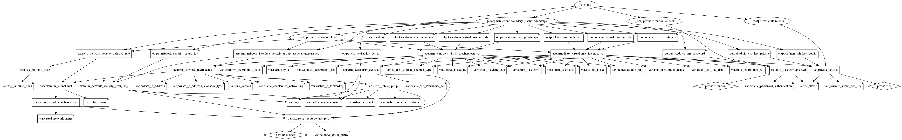

# Azure Virtual Machines Terraform Module

Terraform module to deploy azure Windows or Linux virtual machines with Public IP, proximity placement group, Availability Set, boot diagnostics, data disks, and Network Security Group support. It supports existing ssh keys or generates ssh key pairs if required for Linux VM's. It creates random passwords as well if you are not providing the custom password for Windows VM's.

This module supports to use existing NSG group. To enable this feature, specify the argument `existing_network_security_group_id` with a valid resource id of the current NSG group and remove all NSG inbound rules from the module.

## Resources Supported

* [Linux Virtual Machine](https://www.terraform.io/docs/providers/azurerm/r/linux_virtual_machine.html)
* [Windows Virtual Machine](https://www.terraform.io/docs/providers/azurerm/r/windows_virtual_machine.html)
* [Linux VM with SQL Server](https://docs.microsoft.com/en-us/azure/azure-sql/virtual-machines/linux/sql-vm-create-portal-quickstart)
* [Windows VM with SQL Server](https://docs.microsoft.com/en-us/azure/azure-sql/virtual-machines/windows/sql-vm-create-portal-quickstart)
* [Managed Data Disks](https://registry.terraform.io/providers/hashicorp/azurerm/latest/docs/resources/managed_disk)
* [Boot Diagnostics](https://registry.terraform.io/providers/hashicorp/azurerm/latest/docs/resources/windows_virtual_machine#boot_diagnostics)
* [Proximity Placement Group](https://registry.terraform.io/providers/hashicorp/azurerm/latest/docs/resources/proximity_placement_group)
* [Availability Set](https://www.terraform.io/docs/providers/azurerm/r/availability_set.html)
* [Public IP](https://www.terraform.io/docs/providers/azurerm/r/public_ip.html)
* [Network Security Group](https://www.terraform.io/docs/providers/azurerm/r/network_security_group.html)
* [Managed Identities](https://registry.terraform.io/providers/hashicorp/azurerm/latest/docs/resources/windows_virtual_machine#identity)
* [Custom Data](https://registry.terraform.io/providers/hashicorp/azurerm/latest/docs/resources/windows_virtual_machine#custom_data)
* [Additional_Unattend_Content](https://registry.terraform.io/providers/hashicorp/azurerm/latest/docs/resources/windows_virtual_machine#additional_unattend_content)
* [SSH2 Key generation for Dev Environments](https://www.terraform.io/docs/providers/tls/r/private_key.html)
* [Azure Monitoring Diagnostics](https://www.terraform.io/docs/providers/azurerm/r/monitor_diagnostic_setting.html)
* [Log Analytics Agent Installation](https://docs.microsoft.com/en-us/azure/azure-monitor/agents/log-analytics-agent)

## Module Usage

```terraform
# Azurerm provider configuration
provider "azurerm" {
  features {}
}

data "azurerm_log_analytics_workspace" "example" {
  name                = "loganalytics-we-sharedtest2"
  resource_group_name = "rg-shared-westeurope-01"
}

module "virtual-machine" {
  source  = "kumarvna/virtual-machine/azurerm"
  version = "2.3.0"

  # Resource Group, location, VNet and Subnet details
  resource_group_name  = "rg-shared-westeurope-01"
  location             = "westeurope"
  virtual_network_name = "vnet-shared-hub-westeurope-001"
  subnet_name          = "snet-management"
  virtual_machine_name = "vm-linux"

  # This module support multiple Pre-Defined Linux and Windows Distributions.
  # Check the README.md file for more pre-defined images for Ubuntu, Centos, RedHat.
  # Please make sure to use gen2 images supported VM sizes if you use gen2 distributions
  # Specify `disable_password_authentication = false` to create random admin password
  # Specify a valid password with `admin_password` argument to use your own password 
  # To generate SSH key pair, specify `generate_admin_ssh_key = true`
  # To use existing key pair, specify `admin_ssh_key_data` to a valid SSH public key path.  
  os_flavor               = "linux"
  linux_distribution_name = "ubuntu2004"
  virtual_machine_size    = "Standard_B2s"
  generate_admin_ssh_key  = true
  instances_count         = 2

  # Proxymity placement group, Availability Set and adding Public IP to VM's are optional.
  # remove these argument from module if you dont want to use it.  
  enable_proximity_placement_group = true
  enable_vm_availability_set       = true
  enable_public_ip_address         = true

  # Network Seurity group port allow definitions for each Virtual Machine
  # NSG association to be added automatically for all network interfaces.
  # Remove this NSG rules block, if `existing_network_security_group_id` is specified
  nsg_inbound_rules = [
    {
      name                   = "ssh"
      destination_port_range = "22"
      source_address_prefix  = "*"
    },
    {
      name                   = "http"
      destination_port_range = "80"
      source_address_prefix  = "*"
    },
  ]

  # Boot diagnostics to troubleshoot virtual machines, by default uses managed 
  # To use custom storage account, specify `storage_account_name` with a valid name
  # Passing a `null` value will utilize a Managed Storage Account to store Boot Diagnostics
  enable_boot_diagnostics = true

  # Attach a managed data disk to a Windows/Linux VM's. Possible Storage account type are: 
  # `Standard_LRS`, `StandardSSD_ZRS`, `Premium_LRS`, `Premium_ZRS`, `StandardSSD_LRS`
  # or `UltraSSD_LRS` (UltraSSD_LRS only available in a region that support availability zones)
  # Initialize a new data disk - you need to connect to the VM and run diskmanagemnet or fdisk
  data_disks = [
    {
      name                 = "disk1"
      disk_size_gb         = 100
      storage_account_type = "StandardSSD_LRS"
    },
    {
      name                 = "disk2"
      disk_size_gb         = 200
      storage_account_type = "Standard_LRS"
    }
  ]

  # (Optional) To enable Azure Monitoring and install log analytics agents
  # (Optional) Specify `storage_account_name` to save monitoring logs to storage.   
  log_analytics_workspace_id = data.azurerm_log_analytics_workspace.example.id

  # Deploy log analytics agents to virtual machine. 
  # Log analytics workspace customer id and primary shared key required.
  deploy_log_analytics_agent                 = true
  log_analytics_customer_id                  = data.azurerm_log_analytics_workspace.example.workspace_id
  log_analytics_workspace_primary_shared_key = data.azurerm_log_analytics_workspace.example.primary_shared_key

  # Adding additional TAG's to your Azure resources
  tags = {
    ProjectName  = "demo-project"
    Env          = "dev"
    Owner        = "user@example.com"
    BusinessUnit = "CORP"
    ServiceClass = "Gold"
  }
}
```

## Default Local Administrator and the Password

This module utilizes __`azureadmin`__ as a local administrator on virtual machines. If you want to you use custom username, then specify the same by setting up the argument `admin_username` with a valid user string.

By default, this module generates a strong password for all virtual machines also allows you to change the length of the random password (currently 24) using the `random_password_length = 32` variable. If you want to set the custom password, specify the argument `admin_password` with a valid string.

This module also generates SSH2 Key pair for Linux servers by default, however, it is only recommended to use for dev environment. For production environments, please generate your own SSH2 key with a passphrase and input the key by providing the path to the argument `admin_ssh_key_data`.

## Pre-Defined Windows and Linux VM Images

There are pre-defined Windows or Linux images available to deploy by setting up the argument `linux_distribution_name` or `windows_distribution_name` with this module.

OS type |Available Pre-defined Images|
--------|----------------------------|
Linux |`ubuntu2004`, `ubuntu2004-gen2`, `ubuntu1904`, `ubuntu1804`, `ubuntu1604`, `centos75`, `centos77`, `centos78-gen2`, `centos79-gen2`, `centos81`, `centos81-gen2`, `centos82-gen2`, `centos83-gen2`, `centos84-gen2` `coreos`, `rhel78`, `rhel78-gen2`, `rhel79`, `rhel79-gen2`, `rhel81`, `rhel81-gen2`, `rhel82`, `rhel82-gen2`, `rhel83`, `rhel83-gen2`, `rhel84`, `rhel84-gen2`, `rhel84-byos`, `rhel84-byos-gen2`
Windows|`windows2012r2dc`, `windows2016dc`, `windows2016dccore`, `windows2019dc`, `windows2019dccore`, `windows2019dccore-g2`, `windows2019dc-gensecond`, `windows2019dc-gs`, `windows2019dc-containers`, `windows2019dc-containers-g2`
MS SQL 2017|`mssql2017exp`, `mssql2017dev`, `mssql2017std`, `mssql2017ent`
MS SQL 2019|`mssql2019dev`, `mssql2019std`, `mssql2019ent`
MS SQL 2019 Linux (RHEL8)|`mssql2019ent-rhel8`, `mssql2019std-rhel8`, `mssql2019dev-rhel8`
MS SQL 2019 Linux (Ubuntu)|`mssql2019ent-ubuntu1804`, `mssql2019std-ubuntu1804`, `mssql2019dev-ubuntu1804`, `mssql2019ent-ubuntu2004`, `mssql2019std-ubuntu2004`, `mssql2019dev-ubuntu2004`
MS SQL 2019 Bring your own License (BOYL)|`mssql2019ent-byol`, `mssql2019std-byol`

## Custom Virtual Machine images

If the pre-defined Windows or Linux variants are not sufficient then, you can specify the custom image by setting up the argument `custom_image` with appropriate values. Custom images can be used to bootstrap configurations such as preloading applications, application configurations, and other OS configurations. For more information [check here](https://docs.microsoft.com/en-us/azure/virtual-machines/linux/tutorial-custom-images)

```terraform
module "virtual-machine" {
  source  = "kumarvna/virtual-machine/azurerm"
  version = "2.3.0"

# .... omitted for bravity
  
  os_flavor               = "linux"
  linux_distribution_name = "ubuntu2004"
  virtual_machine_size    = "Standard_B2s"
  generate_admin_ssh_key  = true
  instances_count         = 2

  custom_image = {
      publisher = "myPublisher"
      offer     = "myOffer"
      sku       = "mySKU"
      version   = "latest"
    }

# .... omitted for bravity

}
```

## Custom DNS servers

This is an optional feature and only applicable if you are using your own DNS servers superseding default DNS services provided by Azure. Set the argument `dns_servers = ["4.4.4.4"]` to enable this option. For multiple DNS servers, set the argument `dns_servers = ["4.4.4.4", "8.8.8.8"]`

## Advanced Usage of the Module

### `disable_password_authentication` - enable or disable VM password authentication

While creating the Linux servers, its recommended to use ssh2 keys to log in than using a password. By default, this module generates the ssh2 key pair for Linux VM's. If you want the password to login Linux VM, set the argument `disable_password_authentication = false`, this instructs the module to create a random password.

### `enable_ip_forwarding` - enable or disable IP forwarding

The setting must be enabled for every network interface that is attached to the virtual machine that receives traffic that the virtual machine needs to forward. A virtual machine can forward traffic whether it has multiple network interfaces or a single network interface attached to it. While IP forwarding is an Azure setting, the virtual machine must also run an application able to forward the traffic, such as firewall, WAN optimization, and load balancing applications. IP forwarding is typically used with user-defined routes.

By default, this not enabled and set to disable. To enable the IP forwarding using this module, set the argument `enable_ip_forwarding = true`.

### `enable_accelerated_networking` for Virtual Machines

Accelerated networking enables single root I/O virtualization (SR-IOV) to a VM, greatly improving its networking performance. This high-performance path bypasses the host from the data path, which reduces latency, jitter, and CPU utilization for the most demanding network workloads on supported VM types.

Accelerated Networking is supported on most general-purpose and compute-optimized instance sizes with two or more virtual CPUs (vCPUs). These supported series are Dv2/DSv2 and F/Fs.

On instances that support hyperthreading, accelerated networking is supported on VM instances with four or more vCPUs. Supported series are: D/Dsv3, D/Dsv4, E/Esv3, Ea/Easv4, Fsv2, Lsv2, Ms/Mms, and Ms/Mmsv2.

By default, this not enabled and set to disable. To enable the accelerated networking using this module, set the argument `enable_accelerated_networking = true`.

### `private_ip_address_allocation_type` - Static IP Assignment

By default, the Azure DHCP servers assign the private IPv4 address for the primary IP configuration of the Azure network interface to the network interface within the virtual machine operating system. Unless necessary, you should never manually set the IP address of a network interface within the virtual machine's operating system.

By default this not enabled and set to disable. To enable the static private IP using this module, set the argument `private_ip_address_allocation_type = "Static"` and set the argument `private_ip_address` with valid static private IP.

### `dedicated_host_id` - Adding Azure Dedicated Hosts

Azure Dedicated Host is a service that provides physical servers - able to host one or more virtual machines - dedicated to one Azure subscription. Dedicated hosts are the same physical servers used in our data centers, provided as a resource. You can provision dedicated hosts within a region, availability zone, and fault domain. Virtual machine scale sets are not currently supported on dedicated hosts.

By default, this not enabled and set to disable. To add a dedicated host to Virtual machine using this module, set the argument `dedicated_host_id` with valid dedicated host resource ID. It is possible to add Dedicated Host resource outside this module.

### `enable_proximity_placement_group` -  Achieving the lowest possible latency

Placing VMs in a single region reduces the physical distance between the instances. Placing them within a single availability zone will also bring them physically closer together. However, as the Azure footprint grows, a single availability zone may span multiple physical data centers, which may result in a network latency impacting your application.

To get VMs as close as possible, achieving the lowest possible latency, you should deploy them within a proximity placement group.

A proximity placement group is a logical grouping used to make sure that Azure compute resources are physically located close to each other. Proximity placement groups are useful for workloads where low latency is a requirement.

By default, this not enabled and set to disable. To enable the Proximity placement group with this module, set the argument `enable_proximity_placement_group = true`.

### `enable_vm_availability_set` - Create highly available virtual machines

An Availability Set is a logical grouping capability for isolating VM resources from each other when they're deployed. Azure makes sure that the VMs you place within an Availability Set run across multiple physical servers, compute racks, storage units, and network switches. If a hardware or software failure happens, only a subset of your VMs are impacted and your overall solution stays operational. Availability Sets are essential for building reliable cloud solutions.

By default, this not enabled and set to disable. To enable the Availability Set using this module, set the argument `enable_vm_availability_set = true`.

### `source_image_id` - Create a VM from a managed image

We can create multiple virtual machines from an Azure managed VM image. A managed VM image contains the information necessary to create a VM, including the OS and data disks. The virtual hard disks (VHDs) that make up the image, including both the OS disks and any data disks, are stored as managed disks. One managed image supports up to 20 simultaneous deployments.

When you use the managed VM image, custom image, or any other source image reference are not valid. By default, this not enabled and set to use predefined or custom images. To utilize Azure managed VM Image by this module, set the argument `source_image_id` with valid manage image resource id.

### `license_type` - Bring your own License to your Windows server

Azure Hybrid Benefit for Windows Server allows you to use your on-premises Windows Server licenses and run Windows virtual machines on Azure at a reduced cost. You can use Azure Hybrid Benefit for Windows Server to deploy new virtual machines with Windows OS.

By default, this is set to `None`. To use the Azure Hybrid Benefit for windows server deployment by this module, set the argument `license_type` to valid values. Possible values are `None`, `Windows_Client` and `Windows_Server`.

### `os_disk_storage_account_type` - Azure managed disks

Azure managed disks are block-level storage volumes that are managed by Azure and used with Azure Virtual Machines. Managed disks are like a physical disk in an on-premises server but virtualized. With managed disks, all you have to do is specify the disk size, the disk type, and provision the disk. Once you provision the disk, Azure handles the rest. The available types of disks are ultra disks, premium solid-state drives (SSD), standard SSDs, and standard hard disk drives (HDD).

By default, this module uses the standard SSD with Locally redundant storage (`StandardSSD_LRS`). To use other type of disks, set the argument `os_disk_storage_account_type` with valid values. Possible values are `Standard_LRS`, `StandardSSD_LRS` and `Premium_LRS`.

### `Identity` - Configure managed identities for Azure resources on a VM

Managed identities for Azure resources provides Azure services with an automatically managed identity in Azure Active Directory. You can use this identity to authenticate to any service that supports Azure AD authentication, without having credentials in your code.

There are two types of managed identities:

* **System-assigned**: When enabled a system-assigned managed identity an identity is created in Azure AD that is tied to the lifecycle of that service instance. when the resource is deleted, Azure automatically deletes the identity. By design, only that Azure resource can use this identity to request tokens from Azure AD.
* **User-assigned**: A managed identity as a standalone Azure resource. For User-assigned managed identities, the identity is managed separately from the resources that use it.

Regardless of the type of identity chosen a managed identity is a service principal of a special type that may only be used with Azure resources. When the managed identity is deleted, the corresponding service principal is automatically removed.

```terraform
resource "azurerm_user_assigned_identity" "example" {
  for_each            = toset(["user-identity1", "user-identity2"])
  resource_group_name = "rg-shared-westeurope-01"
  location            = "westeurope"
  name                = each.key
}

module "virtual-machine" {
  source  = "kumarvna/virtual-machine/azurerm"
  version = "2.3.0"

  # .... omitted for bravity
  
  os_flavor               = "linux"
  linux_distribution_name = "ubuntu2004"
  virtual_machine_size    = "Standard_B2s"
  generate_admin_ssh_key  = true
  instances_count         = 2

  # Configure managed identities for Azure resources on a VM
  # Possible types are `SystemAssigned`, `UserAssigned` and `SystemAssigned, UserAssigned`.
  managed_identity_type = "UserAssigned"
  managed_identity_ids  = [for k in azurerm_user_assigned_identity.example : k.id]

# .... omitted for bravity

}
```

### `enable_boot_diagnostics` - boot diagnostics to troubleshoot virtual machines

Boot diagnostics is a debugging feature for Azure virtual machines (VM) that allows the diagnosis of VM boot failures. Boot diagnostics enables a user to observe the state of their VM as it is booting up by collecting serial log information and screenshots. This module enabled this feature by setting up `enable_boot_diagnostics = true`. Azure Storage Account to be used to store Boot Diagnostics, including Console Output and Screenshots from the Hypervisor. This module supports the existing storage account using the `storage_account_name` argument with a valid name. If we are not passing any storage account, it will utilize a Managed Storage Account to store Boot Diagnostics.

### `winrm_protocol` - Enable WinRM wiht HTTPS

Window remote management - in short, `WinRM` is a built-in windows protocol/Service which uses soap[simple object access protocol] to connect from another source system. Using WinRM, we can connect the remote system and execute any command there as its native user.

WinRM comes pre-installed with all new window OS. We need to enable WinRM service and configure the ports for outside traffic. This module configure `winRM` by setting up `winrm_protocol = "Https"` and `key_vault_certificate_secret_url` value to the Secret URL of a Key Vault Certificate.

## Network Security Groups

By default, the network security groups connected to Network Interface and allow necessary traffic and block everything else (deny-all rule). Use `nsg_inbound_rules` in this Terraform module to create a Network Security Group (NSG) for network interface and allow it to add additional rules for inbound flows.

In the Source and Destination columns, `VirtualNetwork`, `AzureLoadBalancer`, and `Internet` are service tags, rather than IP addresses. In the protocol column, Any encompasses `TCP`, `UDP`, and `ICMP`. When creating a rule, you can specify `TCP`, `UDP`, `ICMP` or `*`. `0.0.0.0/0` in the Source and Destination columns represents all addresses.

*You cannot remove the default rules, but you can override them by creating rules with higher priorities.*

```terraform
module "virtual-machine" {
  source  = "kumarvna/virtual-machine/azurerm"
  version = "2.3.0"

# .... omitted for bravity
  
  os_flavor               = "linux"
  linux_distribution_name = "ubuntu2004"
  virtual_machine_size    = "Standard_B2s"
  generate_admin_ssh_key  = true
  instances_count         = 2

  nsg_inbound_rules = [
    {
      name                   = "ssh"
      destination_port_range = "22"
      source_address_prefix  = "*"
    },

    {
      name                   = "http"
      destination_port_range = "80"
      source_address_prefix  = "*"
    },
  ]

# .... omitted for bravity

}
```

## Using exisging Network Security Groups

Enterprise environments may need a requirement to use pre-existing NSG groups to maintain capabilities. This module supports existing network security groups usage. To use this feature, set the argument `existing_network_security_group_id` with a valid NSG resource id and remove all NSG inbound rules blocks from the module.

```terraform
data "azurerm_network_security_group" "example" {
  name                = "nsg_mgnt_subnet_in"
  resource_group_name = "vnet-shared-hub-westeurope-001"
}

module "virtual-machine" {
  source  = "kumarvna/virtual-machine/azurerm"
  version = "2.3.0"

# .... omitted for bravity
  
  os_flavor               = "linux"
  linux_distribution_name = "ubuntu2004"
  virtual_machine_size    = "Standard_B2s"
  generate_admin_ssh_key  = true
  instances_count         = 2

  # Network Seurity group port allow definitions for each Virtual Machine
  # NSG association to be added automatically for all network interfaces.
  # Remove this NSG rules block, if `existing_network_security_group_id` is specified
  existing_network_security_group_id = data.azurerm_network_security_group.example.id

# .... omitted for bravity

}
```

## Recommended naming and tagging conventions

Applying tags to your Azure resources, resource groups, and subscriptions to logically organize them into a taxonomy. Each tag consists of a name and a value pair. For example, you can apply the name `Environment` and the value `Production` to all the resources in production.
For recommendations on how to implement a tagging strategy, see Resource naming and tagging decision guide.

>**Important** :
Tag names are case-insensitive for operations. A tag with a tag name, regardless of the casing, is updated or retrieved. However, the resource provider might keep the casing you provide for the tag name. You'll see that casing in cost reports. **Tag values are case-sensitive.**

An effective naming convention assembles resource names by using important resource information as parts of a resource's name. For example, using these [recommended naming conventions](https://docs.microsoft.com/en-us/azure/cloud-adoption-framework/ready/azure-best-practices/naming-and-tagging#example-names), a public IP resource for a production SharePoint workload is named like this: `pip-sharepoint-prod-westus-001`.

## Requirements

| Name | Version |
|------|---------|
| terraform | >= 0.13 |
| azurerm | >= 2.59.0 |

## Providers

| Name | Version |
|------|---------|
| azurerm | >= 2.59.0 |
| random | >= 3.1.0 |
| tls | >= 3.1.0 |

## Inputs

Name | Description | Type | Default
---- | ----------- | ---- | -------
`resource_group_name` | The name of the resource group in which resources are created | string | `""`
`location`|The location of the resource group in which resources are created|string | `""`
`virtual_network_name`|The name of the virtual network|string |`""`
`subnet_name`|The name of the subnet to use in VM scale set|string |`""`
`random_password_length`|The desired length of random password created by this module|number|`24`
`enable_public_ip_address`|Reference to a Public IP Address to associate with the NIC|string|`false`
`public_ip_allocation_method`|Defines the allocation method for this IP address. Possible values are `Static` or `Dynamic`|string|`Static`
`public_ip_sku`|The SKU of the Public IP. Accepted values are `Basic` and `Standard`|string|`Standard`
`domain_name_label`|Label for the Domain Name. Will be used to make up the FQDN. If a domain name label is specified, an A DNS record is created for the public IP in the Microsoft Azure DNS system|string|`null`
`public_ip_availability_zone`|The availability zone to allocate the Public IP in. Possible values are `Zone-Redundant`, `1`,`2`, `3`, and `No-Zone`|string|`"Zone-Redundant"`
`public_ip_sku_tier`|The SKU Tier that should be used for the Public IP. Possible values are `Regional` and `Global`|string|`"Regional"`
`dns_servers`|List of dns servers to use for network interface|string|`[]`
`enable_ip_forwarding`|Should IP Forwarding be enabled?|string|`false`
`enable_accelerated_networking`|Should Accelerated Networking be enabled?|string|`false`
`private_ip_address_allocation_type`|The allocation method used for the Private IP Address. Possible values are Dynamic and Static.|string|`Dynamic`
`private_ip_address`|The Static IP Address which should be used. This is valid only when `private_ip_address_allocation` is set to `Static`.|string|`null`
`enable_vm_availability_set`|Manages an Availability Set for Virtual Machines.|string|`false`
`platform_fault_domain_count`|Specifies the number of fault domains that are used|number|`3`
`platform_update_domain_count`|Specifies the number of update domains that are used|number|`5`
`enable_proximity_placement_group`|Manages a proximity placement group for virtual machines, virtual machine scale sets and availability sets|string|`false`
`existing_network_security_group_id`|The resource id of existing network security group|string|`null`
`nsg_inbound_rules`|List of network rules to apply to network interface|object|`{}`
`virtual_machine_name`|The name of the virtual machine|string | `""`
`instances_count`|The number of Virtual Machines required|number|`1`
`os_flavor`|Specify the flavor of the operating system image to deploy Virtual Machine. Possible values are `windows` and `linux`|string |`"windows"`
`virtual_machine_size`|The Virtual Machine SKU for the Virtual Machine|string|`"Standard_A2_v2"`
`disable_password_authentication`|Should Password Authentication be disabled on this Virtual Machine. Applicable to Linux Virtual machine|string|`true`
`admin_username`|The username of the local administrator used for the Virtual Machine|string|`"azureadmin"`
`admin_password`|The Password which should be used for the local-administrator on this Virtual Machine|string|`null`
`source_image_id`|The ID of an Image which each Virtual Machine should be based on|string|`null`
`dedicated_host_id`|The ID of a Dedicated Host where this machine should be run on|string|`null`
`custom_data`|Base64 encoded file of a bash script that gets run once by cloud-init upon VM creation|string|`null`
`enable_automatic_updates`|Specifies if Automatic Updates are Enabled for the Windows Virtual Machine|string|`false`
`enable_encryption_at_host`|Should all of the disks (including the temp disk) attached to this Virtual Machine be encrypted by enabling Encryption at Host?|string|`false`
`vm_availability_zone`|The Zone in which this Virtual Machine should be created. Conflicts with availability set and shouldn't use both.|string|`null`
`patch_mode`|Specifies the mode of in-guest patching to this Windows Virtual Machine. Possible values are `Manual`, `AutomaticByOS` and `AutomaticByPlatform`|string|`"AutomaticByOS"`
`license_type`|Specifies the type of on-premise license which should be used for this Virtual Machine. Possible values are `None`, `Windows_Client` and `Windows_Server`.|string|`"None"`
`vm_time_zone`|Specifies the Time Zone which should be used by the Virtual Machine. Ex. `"UTC"` or `"W. Europe Standard Time"` [The possible values are defined here](https://jackstromberg.com/2017/01/list-of-time-zones-consumed-by-azure/) |string|`null`
`generate_admin_ssh_key`|Generates a secure private key and encodes it as PEM|string|`true`
`admin_ssh_key_data`|specify the path to the existing SSH key to authenticate Linux virtual machine|string|`""`
`custom_image`|Provide the custom image to this module if the default variants are not sufficient|map(object)|`null`
`linux_distribution_list`|Pre-defined Azure Linux VM images list|map(object)|`ubuntu1804`
`linux_distribution_name`|Variable to pick an OS flavor for Linux based Virtual Machine. Possible values are `ubuntu2004`, `ubuntu2004-gen2`, `ubuntu1904`, `ubuntu1804`, `ubuntu1604`, `centos75`, `centos77`, `centos78-gen2`, `centos79-gen2`, `centos81`, `centos81-gen2`, `centos82-gen2`, `centos83-gen2`, `centos84-gen2` `coreos`, `rhel78`, `rhel78-gen2`, `rhel79`, `rhel79-gen2`, `rhel81`, `rhel81-gen2`, `rhel82`, `rhel82-gen2`, `rhel83`, `rhel83-gen2`, `rhel84`, `rhel84-gen2`, `rhel84-byos`, `rhel84-byos-gen2`, `mssql2019ent-rhel8`, `mssql2019std-rhel8`, `mssql2019dev-rhel8`, `mssql2019ent-ubuntu1804`, `mssql2019std-ubuntu1804`, `mssql2019dev-ubuntu1804`, `mssql2019ent-ubuntu2004`, `mssql2019std-ubuntu2004`, `mssql2019dev-ubuntu2004`|string|`ubuntu1804`
`windows_distribution_list`|Pre-defined Azure Windows VM images list|map(object)|`"windows2019dc"`
`windows_distribution_name`|Variable to pick an OS flavor for Windows based VM. Possible values are `windows2012r2dc`, `windows2016dc`, `windows2016dccore`, `windows2019dc`, `windows2019dccore`, `windows2019dccore-g2`, `windows2019dc-gensecond`, `windows2019dc-gs`, `windows2019dc-containers`, `windows2019dc-containers-g2`, `mssql2017exp`, `mssql2017dev`, `mssql2017std`, `mssql2017ent`, `mssql2019dev`, `mssql2019std`, `mssql2019ent`, `mssql2019ent-byol`, `mssql2019std-byol`|string|`"windows2019dc"`
`os_disk_storage_account_type`|The Type of Storage Account for Internal OS Disk. Possible values include Standard_LRS, StandardSSD_LRS and Premium_LRS.|string|`"StandardSSD_LRS"`
`os_disk_caching`|The Type of Caching which should be used for the Internal OS Disk. Possible values are `None`, `ReadOnly` and `ReadWrite`|string|`"ReadWrite"`
`disk_encryption_set_id`|The ID of the Disk Encryption Set which should be used to Encrypt this OS Disk. The Disk Encryption Set must have the `Reader` Role Assignment scoped on the Key Vault - in addition to an Access Policy to the Key Vault|string|`null`
`disk_size_gb`|The Size of the Internal OS Disk in GB, if you wish to vary from the size used in the image this Virtual Machine is sourced from|number|`null`
`enable_os_disk_write_accelerator`|Should Write Accelerator be Enabled for this OS Disk? This requires that the `storage_account_type` is set to `Premium_LRS` and that `caching` is set to `None`|string|`false`
`os_disk_name`|The name which should be used for the Internal OS Disk|string|`null`
`enable_ultra_ssd_data_disk_storage_support`|Should the capacity to enable Data Disks of the UltraSSD_LRS storage account type be supported on this Virtual Machine|string|`false`
`managed_identity_type`|The type of Managed Identity which should be assigned to the Linux Virtual Machine. Possible values are `SystemAssigned`, `UserAssigned` and `SystemAssigned, UserAssigned`|string|`null`
`managed_identity_ids`|A list of User Managed Identity ID's which should be assigned to the Linux Virtual Machine.|string|`null`
`winrm_protocol`|Specifies the protocol of winrm listener. Possible values are `Http` or `Https`|string|`null`
`key_vault_certificate_secret_url`|The Secret URL of a Key Vault Certificate, which must be specified when `protocol` is set to `Https`|string|`null`
`additional_unattend_content`|The XML formatted content that is added to the unattend.xml file for the specified path and component|string|`null`
`additional_unattend_content_setting`|The name of the setting to which the content applies. Possible values are `AutoLogon` and `FirstLogonCommands`|string|`null`
`enable_boot_diagnostics`|Should the boot diagnostics enabled?|string|`false`
`storage_account_uri`|The Primary/Secondary Endpoint for the Azure Storage Account which should be used to store Boot Diagnostics, including Console Output and Screenshots from the Hypervisor. Passing a `null` value will utilize a Managed Storage Account to store Boot Diagnostics|string|`null`
`data_disks`|Managed Data Disks for azure viratual machine|list|`[]`
`storage_account_name`|The name of the storage account name|string|`null`
`deploy_log_analytics_agent`|Install log analytics agent to windows or linux VM|string|`false`
`log_analytics_workspace_id`|The name of log analytics workspace resource id|string|`null`
`log_analytics_customer_id`|The Workspace (or Customer) ID for the Log Analytics Workspace|string|`null`
`log_analytics_workspace_primary_shared_key`|The Primary shared key for the Log Analytics Workspace|string|`null`
`intall_iis_server_on_instances`|Install ISS server on every Instance in the VM scale set|string|`false`
`Tags`|A map of tags to add to all resources|map|`{}`

## Outputs

|Name | Description|
|---- | -----------|
`admin_ssh_key_public`|The generated public key data in PEM format
`admin_ssh_key_private`|The generated private key data in PEM format
`windows_vm_password`|Password for the Windows Virtual Machine
`linux_vm_password`|Password for the Linux Virtual Machine
`windows_vm_public_ips`|Public IP's map for the all windows Virtual Machines
`linux_vm_public_ips`|Public IP's map for the all windows Virtual Machines
`windows_vm_private_ips`|Public IP's map for the all windows Virtual Machines
`linux_vm_private_ips`|Public IP's map for the all windows Virtual Machines
`linux_virtual_machine_ids`|The resource id's of all Linux Virtual Machine
`windows_virtual_machine_ids`|The resource id's of all Windows Virtual Machine
`network_security_group_ids`|List of Network security groups and ids
`vm_availability_set_id`|The resource ID of Virtual Machine availability set

## Resource Graph



## Authors

Originally created by [Kumaraswamy Vithanala](mailto:kumarvna@gmail.com).

## Other resources

* [Windows Virtual Machine](https://docs.microsoft.com/en-us/azure/virtual-machines/windows/)
* [Linux Virtual Machine](https://docs.microsoft.com/en-us/azure/virtual-machines/linux/)
* [Linux VM running SQL Server](https://docs.microsoft.com/en-us/azure/azure-sql/virtual-machines/linux/sql-vm-create-portal-quickstart)
* [Windows VM running SQL Server](https://docs.microsoft.com/en-us/azure/azure-sql/virtual-machines/windows/sql-vm-create-portal-quickstart)
* [Terraform AzureRM Provider Documentation](https://www.terraform.io/docs/providers/azurerm/index.html)
